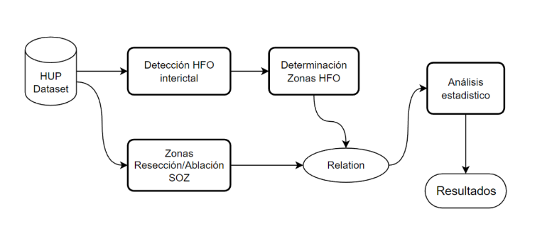

# Análisis de HFOs en SEEG de pacientes con epilepsia



## Base de datos

La base de datos (BBDD) utilizada en este estudio, denominada “HUP iEEG dataset”, se compone de un total de 58 pacientes diagnosticados con epilepsia refractaria que han sido intervenidos quirúrgicamente (Bernabei J.M et Al)

La BBDD estructurada bajo el estandar BIDS (Brain Imaging Dataset) y alojada en HUP, se descarga automaticamente para su procesamiento utilizando el [cliente python de OpenNeuro](https://github.com/hoechenberger/openneuro-py).

## Estructura

#### data_processing.py >> script de procesamiento principal

* Datos de entrada: aqui se definen los argumentos para la configuración del procesamiento de HFOs y para la descarga de la base de datos.

  ```python
  kwargs_for_combine = {
           'lower_freq':   40,
           'upper_freq':   249,
           'band_width':   60,
           'window_min':   50,
           'window_max':   150,
           'window_step':  20
              }

  kwargs_bids = {
          'dataset':'data/bids/ds004100',
          'datatype':'ieeg',
          'task':'interictal',
          'acquisition':'seeg',
          'run':'01'
          }  
  ```

- Resultados: En el directorio 'data/processed' se almacenan en formato binario (.pickle) los resultados del procesamiento de cada registro. Se tiene un archivo por cada registro. Este repositorio contiene los datos ya procesados, pero es posible volver a generarlos de ser necesario, probando con las mismas, o configuraciones diferentes.
